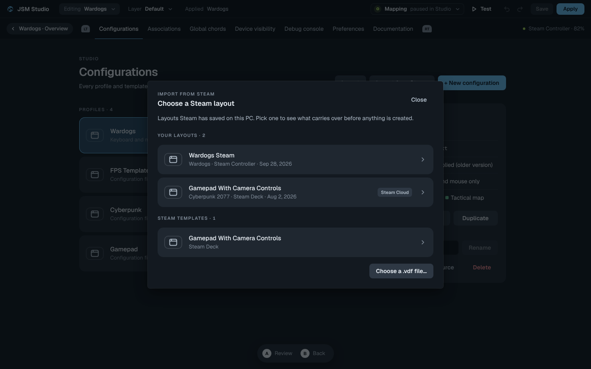
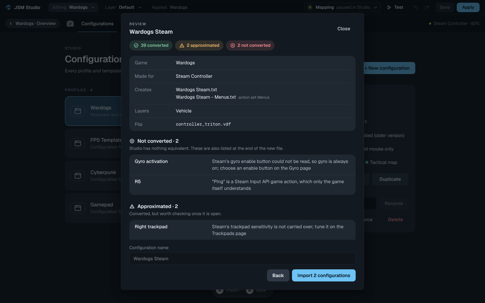

# Importing Steam Input layouts

**Configurations → Import from Steam** turns a Steam Input layout (`.vdf`) into
Studio configurations. The dialog lists the layouts Steam has on this PC, or
takes any `.vdf` file, and shows what carries over before anything is created.

## Where layouts come from

`src-tauri/src/services/steam_layouts.rs` searches each Steam install (the
registry's `SteamPath` and the default folders on Windows; `~/.steam`,
`~/.local/share/Steam` and the Flatpak folder elsewhere):

| Folder | Listed as |
| --- | --- |
| `steamapps/common/Steam Controller Configs/<account>/config/<game>/*.vdf` | Your layouts |
| `userdata/<account>/241100/remote/controller_config/<game>/*.vdf` | Your layouts, tagged Steam Cloud |
| `controller_base/templates/*.vdf` | Steam templates |

A numeric `<game>` folder is a Steam app id, named from its `appmanifest_<id>.acf`
in any library folder listed in `libraryfolders.vdf`.

## What converts to what

The conversion is `src/utils/steamLayout.ts`. It reads both file versions Steam
writes: version 3 (activators and presets) and version 2 (bare binding strings,
which Valve's own templates still use).

| Steam | Studio |
| --- | --- |
| Action set | Its own configuration, named `<layout> - <set>`; `CHANGE_PRESET` becomes a binding that loads it |
| Action layer | A `# @layer` with its overrides ([config-layers.md](config-layers.md)) |
| Add / remove / hold layer | `# @layer-action` apply / remove / hold; apply and remove on one button become toggle |
| Mode shift | Chorded settings and bindings, `L4,RIGHT_STICK_MODE = RADIAL_MENU` |
| Full / soft / start / release press | Plain, `\`, `!X\` and `!X/` bindings |
| Long press, double press, chord | Tap-hold `A B`, `X,X =`, `MOD,X =`; Steam's timing becomes `HOLD_PRESS_TIME` / `DBL_PRESS_WINDOW` when every button agrees |
| Toggle, turbo | `^X\`, `X+` |
| Binding label | `# @label` |
| Keyboard, mouse buttons, scroll | The same keys |
| Gamepad buttons, joystick and trigger output | `VIRTUAL_CONTROLLER = XBOX`, `X_*` outputs, stick `LEFT_STICK` / `RIGHT_STICK`, `ZL_MODE = X_LT` |
| Stick as dpad, flick stick, mouse, mouse region, scroll wheel, radial menu | `NO_MOUSE` directions, `FLICK`, `AIM`, `MOUSE_AREA`, `SCROLL_WHEEL`, `RADIAL_MENU` with `LM`/`RM` items |
| Trackpad as mouse, dpad / four buttons, touch menu, radial menu, joystick | `MOUSE`, a `FOUR_WAY` grid, a `RECTANGLE` grid, a `RADIAL` grid, a touch stick |
| Trigger soft pull and full pull | `ZL` and `ZLF` with `ZL_MODE = NO_SKIP` |
| Gyro to mouse / to joystick | `GYRO_OUTPUT` with a starting `GYRO_SENS` |

Everything else is listed in the review as **Approximated** (converted, worth a
check) or **Not converted** (no equivalent), and the same list is written as a
comment at the top of the new file. Nothing is dropped without being named.
Known gaps: Steam Input API game actions (only the game understands them),
Steam-only actions such as on-screen keyboard or camera reset, Steam's gyro
enable button setting, per-button long-press times that differ, and sensitivity
values, which Steam measures differently.

## Assumptions to confirm on real layouts

These were read from Valve's templates, not documented anywhere, so they are
the first thing to check if an import looks wrong:

- `CHANGE_PRESET n` and the layer actions count presets from 1, so `n` is the
  preset whose `id` is `n - 1`. A file that uses the id itself still resolves.
- `output_joystick` is `0` for the left stick and `1` for the right, matching
  `output_trigger`'s `1` left / `2` right; unset means the source's own side.
- The Steam Controller's Quick Access and grip inputs are read as
  `button_quick_access`, `left_grip` and `right_grip`. If Steam names them
  differently they are reported as not converted rather than guessed at.

## Tests

`tests/steam_layout_import_regression.cjs` converts the fixtures in
`tests/fixtures/steam/` and saves the result through the real save path;
`tests/steam_import_browser_regression.cjs` drives the dialog end to end. The
Rust listing has unit tests in `steam_layouts.rs`.
